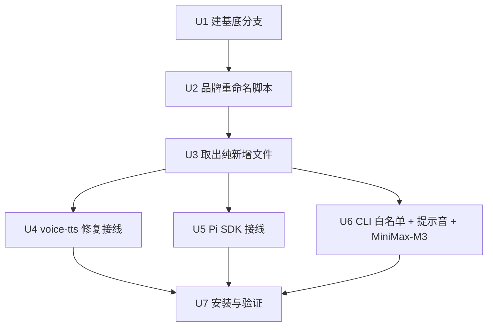
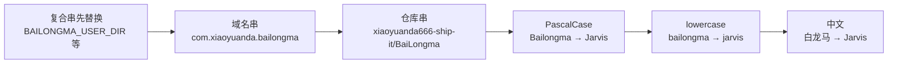

# Rebuild rebrand/to-jarvis on upstream v2.1.515 - Plan

## Goal Capsule

- **Objective:** 以 `upstream/main`（v2.1.515，227 commits 的大版本重构）为基底，重建当前 `rebrand/to-jarvis` 分支承载的 6 项工作，产出一个功能完整、测试通过、品牌统一为 Jarvis 的新分支。
- **Authority hierarchy:** AGENTS.md 硬规则（不破坏工具 JSON 形状 / HTTP API 形状 / system-context prompt 分离）优先于一切；upstream 的代码结构优先于旧分支的实现细节——功能性改动以 upstream 的新结构为准重新接线，不做机械 cherry-pick。
- **Execution profile:** 在新分支 `rebuild/on-upstream` 上操作，`rebrand/to-jarvis` 和 origin 远程完全不动，作为安全回退点。
- **Stop conditions:** 全部测试通过 + 品牌重命名无残留 + 应用能正常启动跑通主循环；或遇到无法手工解决的架构性冲突（如 upstream 重写了 runTurn 使 Pi 分流不再可行），此时暂停并向用户报告。
- **Tail ownership:** 完成后由用户决定是否 push 新分支到 fork、是否替换 `rebrand/to-jarvis`。

---

## Product Contract

### Summary

当前分支 `rebrand/to-jarvis` 从分叉点 `dc29355`（v2.1.383）起积累了 7 个提交、119 个文件改动，而 `upstream/main` 在同一时期积累了 227 个提交、333 个文件、+69840/-11854 行的大重构。直接 merge 会产生 23 个内容冲突 + 5 个删除冲突，且大量是品牌重命名 token 撞 upstream 重构的机械冲突。

方案 A 以 upstream 为基底重建，而非在旧分支上 merge 进 upstream。品牌重命名用 sed 脚本重做（机械替换，可脚本化）；功能性改动逐个对照 upstream 新结构重新接线（不做盲目 cherry-pick）。

### Problem Frame

两个分支在同一时期独立演进，产生了大量同区域改动：

- **品牌重命名撞重构**：你的 `BAILONGMA→JARVIS` 全局替换 vs upstream 的代码结构变更，git 无法自动合并相同行的不同改动。涉及 `electron/main.cjs`(7 冲突块)、`src/api.js`(2 块)、`src/index.js`(2 块)、`website.html` 等。
- **功能性改动撞重构**：你的 Pi turn-engine 分流改了 `src/index.js` 的 `runTurn`，upstream 也重构了 `runTurn`（+363 -474）；voice-tts 修复改了 `src/llm.js` 的 `streamOnce`，upstream 抽出了 `buildChatCompletionRequestParams`。
- **删除冲突**：upstream 删了你改过的 5 个旧文档（`BUILD-NOTES.md`、`RELEASE.md`、`REFACTOR-*.md`、`ACUI-Phase1-设计稿.md`）。

merge 的 28 个冲突里，约 15 个是纯机械的品牌 token 冲突，6 个是需要人工判断的语义冲突。重建避免逐个手工解冲突，改为「以 upstream 为基底 + 脚本重做品牌 + 重新接线功能」。

### Requirements

**品牌身份**

- R1. 重建分支的品牌统一为 Jarvis：UI/prompt/自知识/文档/安装器/包元数据中不再出现「白龙马/Bailongma/bailongma」（`.claude/prds/` 历史 PRD 除外）。
- R2. 环境变量 `BAILONGMA_*` 全系列映射为 `JARVIS_*`（`_USER_DIR`/`_RESOURCES_DIR`/`_HOST`/`_PORT`/`_ALLOW_LAN`/`_API_TOKEN`）。
- R3. 包元数据 `name`/`appId`/`productName`/`publish` 目标改为 jarvis 系列；`appId` 从 `com.xiaoyuanda.bailongma` 改为 `com.richardiitse.jarvis`。

**功能性移植**

- R4. voice-tts 修复完整移植：`thinkFromField` 标志区分 DeepSeek 字段式推理与 MiniMax 内联 `<think>` 标签式推理，内联式不再提前关闭 think 流导致推理泄漏进 TTS。此 bug upstream 至今未修，移植有独立价值。
- R5. Pi SDK turn-engine 完整移植：`src/pi/*` 4 个新文件入仓 + `turnEngine` flag（默认 `llm` 零回归）+ `runTurn` 按 flag 分流到 `runPiTurn`（惰性 import）。
- R6. CLI 白名单工具完整移植：`cli-whitelist.js` + `run_cli` schema + executor 注册 + tool-router 注入。
- R7. 关闭回复提示音开关完整移植：`alert-sound-pref.js` + UI 接入（app.js/app-shell.js/chat.js）。
- R8. MiniMax-M3 模型支持移植：`MINIMAX_MODELS` 追加 M3 条目，默认不变。

**集成与验证**

- R9. 重建分支通过全部可运行的单元测试（纯逻辑/合成客户端测试，排除受 better-sqlite3 ABI 不匹配影响的测试）。
- R10. `package-lock.json` 通过 `npm install` 重新生成，不手改锁文件。

### Scope Boundaries

**In scope**

- 上述 R1-R10 的全部工作。
- 在新分支 `rebuild/on-upstream` 上完成全部重建。

**Deferred for later**

- upstream v2.1.515 引入的新功能（scene-shell、terminal-stream、self-evolution、kws-model、macos-speech 等）的深度适配——这些已在 upstream 基底中存在，重建分支自然继承它们，但不在本次工作范围内做额外适配或验证。
- Windows 安装器重新打包（需 `npm run build` + electron-builder，属发版工作）。
- `package.json` 的 `publish` 目标仓库最终归属（`richardiitse/Jarvis` vs `richardiitse/BaiLongma`）——品牌重命名脚本会改 publish 配置，但新仓库的创建和推送属后续运维。

**Outside this product's identity**

- upstream 的 5 个已删除文档（`BUILD-NOTES.md` 等）不恢复——接受 upstream 的删除决策。
- 旧分支的 Pi SDK 计划文档（`.claude/plans/pi-sdk-*.md`）不迁移——它们记录的是旧分支的实现路径，重建后的接线方式可能不同。

---

## Planning Contract

### Key Technical Decisions

- **KTD1. 以 upstream/main 为基底重建，不在旧分支上 merge。** upstream 领先 227 提交且含 runTurn/llm.js/executor 大重构；merge 会产生 28 个冲突且多数是品牌 token 撞重构的机械冲突。重建把品牌重命名脚本化重做，把功能改动对照 upstream 新结构重新接线，避免逐行解冲突。代价是提交历史重建，但 `rebrand/to-jarvis` 保留为安全回退点。

- **KTD2. 品牌重命名用 sed 脚本批量执行，不做 cherry-pick。** 品牌 commit（7e8298d）改了 94 个文件但本质是 3 个源 token（`白龙马`/`Bailongma`/`bailongma`）→ 2 个目标（`Jarvis`/`jarvis`）的机械替换。脚本化可一次性应用到 upstream 基底，避免 94 文件的 cherry-pick 冲突。脚本按特异性排序（长串先替换防子串误伤）。

- **KTD3. 功能性改动对照 upstream 新结构重新接线，不做盲目 cherry-pick。** upstream 重构了 runTurn/llm.js/executor/app.js 等核心文件。旧分支的改动基于 v2.1.383 结构，cherry-pick 必冲突。改为读旧分支 diff、理解意图、在 upstream 新代码上重新实现同等语义。关键：voice-tts 的 `thinkFromField` 加到 upstream 的 `streamOnce`（已确认只 1 个不重叠冲突块）；Pi 的 `runPiTurn` 分流加到 upstream 的 `runTurn` 入口。

- **KTD4. 纯新增文件直接从旧分支取出，不做 cherry-pick。** `src/pi/*`(4 文件)、`src/cli-whitelist.js`、`src/capabilities/schemas/cli.js`、各测试文件——upstream 没有，用 `git checkout rebrand/to-jarvis -- <file>` 直接取出，零冲突。

- **KTD5. 锁文件重新生成，不手改。** `package-lock.json` 是合并冲突高发区且手改极易出错。合并 package.json 的依赖声明后用 `npm install` 重新生成。

### High-Level Technical Design

重建在 7 个实现单元中分 4 个阶段推进。阶段间有严格依赖：品牌重命名必须在功能性移植之前（功能性文件也会被品牌脚本扫到，如 `src/llm.js` 里旧分支已改为 Jarvis 的注释），新增文件取出在品牌重命名之后（避免脚本误改新文件中尚未存在的路径），手工接线依赖前两者的结果。

**品牌 token 替换顺序**（长串先替换，防子串误伤）：

注意：lowercase `bailongma` 必须在所有复合串替换之后执行，否则 `BAILONGMA_USER_DIR` 中的 `bailongma` 子串会先被部分替换。同理 PascalCase `Bailongma` 在 `com.xiaoyuanda.bailongma` 之后。

### Assumptions

- upstream v2.1.515 的核心架构（TICK 主循环、记忆系统、能力系统）与 v2.1.383 兼容到可以重建——upstream 的重构是内部优化而非架构重写（已确认 runTurn 仍存在、callLLM 仍存在、streamOnce 仍存在）。
- upstream 的 `streamOnce` 仍然有 voice-tts 的 bug（已确认：upstream llm.js L252-293 无 `thinkFromField`，think 提前关闭逻辑无差别触发）。
- Node CLI 的 better-sqlite3 ABI 不匹配（Electron ABI 130 vs Node 22 ABI 127）不影响纯逻辑测试——cli-whitelist/test-llm-stream-reasoning/test-pi-tool-bridge/test-minimax-models/test-alert-sound 不写 SQLite。

### Implementation Constraints

- **不破坏工具 JSON 形状**（AGENTS.md 硬规则 1）：`src/capabilities/schemas/*.js` 的 wire-level 名称是公共契约。
- **不破坏 HTTP API JSON 形状**（硬规则 2）：Brain UI 消费的 endpoint 格式不变。
- **不破坏 system/context prompt 分离**（硬规则 3）：`buildSystemPrompt` 返回稳定系统；`buildContextBlock` 每轮重建且不写回 DB。
- **不写真实 API key 到提交文件**（硬规则 6）。

---

## Implementation Units

### U1. 创建重建基底分支

- **Goal:** 从 `upstream/main` 创建新分支 `rebuild/on-upstream`，作为重建工作区。确认工作区是 upstream v2.1.515 的完整状态。
- **Requirements:** 无直接 R-ID 映射——这是前置基础设施。
- **Dependencies:** 无。
- **Files:** 无（仅 git 操作）。
- **Approach:** `git checkout -b rebuild/on-upstream upstream/main`。此时工作区切换到 upstream 的 v2.1.515 完整状态。确认 `git log --oneline -1` 显示 upstream/main 的最新提交。
- **Verification:** `git branch --show-current` 显示 `rebuild/on-upstream`；`git status` 工作区干净。

### U2. 品牌重命名（sed 脚本重做）

- **Goal:** 在 upstream 基底上重新执行品牌重命名，将「白龙马/Bailongma/bailongma」全系列替换为「Jarvis/Jarvis/jarvis」。
- **Requirements:** R1, R2, R3。
- **Dependencies:** U1。
- **Files:** `package.json`, `electron/main.cjs`, `electron/preload.cjs`, `src/api.js`, `src/index.js`, `src/config.js`, `src/paths.js`, `src/prompt.js`, `src/profile/infer.js`, `src/docs/self-knowledge.js`, `src/docs/config-faq.js`, `src/docs/voice-config-faq.js`, `build/installer.nsh`, `index.html`, `activation.html`, `website.html`, `README.md`, `AGENTS.md`, `ARCHITECTURE.md`, 及其余含旧品牌 token 的文件。
- **Approach:**
  写一个 bash 脚本，用 `grep -rl` 找到含旧 token 的文件，逐个 `sed -i ''`（macOS BSD sed 语法）替换。替换按 KTD2 的顺序执行：
  1. 复合环境变量串：`BAILONGMA_USER_DIR`→`JARVIS_USER_DIR`、`BAILONGMA_RESOURCES_DIR`→`JARVIS_RESOURCES_DIR`、`BAILONGMA_ALLOW_LAN`→`JARVIS_ALLOW_LAN`、`BAILONGMA_API_TOKEN`→`JARVIS_API_TOKEN`、`BAILONGMA_HOST`→`JARVIS_HOST`、`BAILONGMA_PORT`→`JARVIS_PORT`。
  2. appId：`com.xiaoyuanda.bailongma`→`com.richardiitse.jarvis`。
  3. 全局变量名：`bailongmaAppControl`→`jarvisAppControl`、`bailongmaVoice`→`jarvisVoice`、`bailongmaMedia`→`jarvisMedia`、`bailongma_activation_warmup_until`→`jarvis_activation_warmup_until`。
  4. 仓库引用：`xiaoyuanda666-ship-it/BaiLongma`→`richardiitse/BaiLongma`（仓库名暂留）。
  5. PascalCase：`Bailongma`→`Jarvis`（覆盖 productName/appId 显示/installer.nsh 函数名 `BailongmaNormalizeInstallDir` 等）。
  6. lowercase：`bailongma`→`jarvis`（package name/env/logs 路径等）。
  7. 中文：`白龙马`→`Jarvis`。

  排除目录：`.git/`、`node_modules/`、`data/`、`sandbox/`、`dist/`、`voice-dist/`、`.claude/prds/`（历史 PRD 不改）。排除 `package-lock.json`（U7 重新生成）。

  installer.nsh 有大量 NSIS 函数名和标签（`bailongmaScanInstallRoot*`、`Bailongma*` 函数名），步骤 5+6 的全局替换覆盖它们。

- **Patterns to follow:** 旧分支 commit 7e8298d 的替换模式（已确认是纯 token 替换）。
- **Test scenarios:**
  - **品牌残留扫描：** 替换后 `grep -rn "白龙马\|Bailongma\|bailongma\|BAILONGMA" src/ electron/ *.html *.json build/ scripts/ README.md AGENTS.md ARCHITECTURE.md` 应仅剩 `.claude/prds/` 路径下的历史 PRD 记录。
  - **appId 正确性：** `grep "appId" package.json` 显示 `com.richardiitse.jarvis`。
  - **env 变量一致性：** `grep "JARVIS_USER_DIR" electron/main.cjs src/paths.js` 两处都有且值一致。
  - **installer.nsh 函数名一致：** `grep -c "Jarvis" build/installer.nsh` 替换后出现次数与旧分支的 `Bailongma` 出现次数对等（函数名/标签全替换）。
- **Verification:** 品牌残留扫描通过（仅 `.claude/prds/` 例外）；package.json 的 name/appId/productName 全部为 jarvis 系列。

### U3. 取出纯新增文件（零冲突）

- **Goal:** 从旧分支直接取出 upstream 不存在的纯新增文件。
- **Requirements:** R5, R6, R7, R8（的测试部分）。
- **Dependencies:** U2（品牌脚本必须在取文件之前跑完，避免新文件被脚本扫到后又要重处理——虽然新文件不含旧品牌 token，但顺序上取文件在品牌之后更安全）。
- **Files:**
  - **Pi SDK：** `src/pi/tool-bridge.js`, `src/pi/tool-transform.js`, `src/pi/turn-engine.js`, `src/pi/worker.mjs`, `src/test-pi-tool-bridge.js`
  - **CLI 白名单：** `src/cli-whitelist.js`, `src/capabilities/schemas/cli.js`, `src/test-cli-whitelist.js`
  - **voice-tts 测试：** `src/test-llm-stream-reasoning.js`
  - **关闭提示音：** `src/ui/brain-ui/alert-sound-pref.js`, `src/test-alert-sound.js`
  - **MiniMax-M3 测试：** `src/test-minimax-models.js`
- **Approach:** 对每个文件 `git checkout rebrand/to-jarvis -- <file>`。这些文件 upstream 没有，取出后直接进入工作区，零冲突。注意 `src/capabilities/schemas/cli.js` 在旧分支已存在（b3d8098 创建），upstream 也有同名文件但内容不同（upstream 没有 cli schema）——此文件需要确认 upstream 版本是否为空/不存在，若 upstream 已有同名文件则需手工合并而非直接覆盖。
- **Execution note:** 取出后立即逐个文件检查是否含旧品牌 token（`白龙马`/`Bailongma`）。旧分支的文件应该已经是 Jarvis 品牌（因为品牌重命名在旧分支已做），但取出 `src/test-llm-stream-reasoning.js` 等新文件需确认。
- **Verification:** 取出的文件全部存在于工作区；`node -e "import('./src/pi/turn-engine.js')"` 等不报语法错误（仅检查可解析，不检查运行时——依赖未装）。

### U4. voice-tts 推理修复接线（llm.js）

- **Goal:** 在 upstream 的 `src/llm.js` 上重新应用 `thinkFromField` 修复 + 导出 `streamOnce` + 测试接缝。
- **Requirements:** R4。
- **Dependencies:** U3（测试文件已取出）。
- **Files:** `src/llm.js`, `src/test-llm-stream-reasoning.js`（已取出）。
- **Approach:**
  upstream 的 `streamOnce`（llm.js ~L167 起）重构了请求参数构建（抽出 `buildChatCompletionRequestParams`）和文本消毒（引入 `emitTextChunk` sanitizer），但 **think 处理逻辑（~L252-293）仍然有那个 bug**：`if (inThink && !thinkDone)` 无差别关闭 think 流，不区分 DeepSeek 字段式 vs MiniMax 内联 `<think>` 标签式。

  重新应用的改动：
  1. 在 `streamOnce` 内部变量声明区（~L170，`let inThink = false` 旁）加 `let thinkFromField = false`。
  2. 在 `reasoning_content` 字段处理分支（~L240），进入 think 时设 `thinkFromField = true`。
  3. 在提前关闭条件加 `&& thinkFromField`：`if (inThink && !thinkDone && thinkFromField)`。
  4. 在内联 `<think>` 标签发现处（~L264）设 `thinkFromField = false`。
  5. 导出 `streamOnce`（`export async function streamOnce`）+ 测试接缝 `_setClientForTest`/`_clearClientForTest`。

  upstream 的 `emitTextChunk` / `flushTextStream` 包装器不影响这些改动——它们是 think 流之外的文本消毒，与 think 模式标记正交。

- **Patterns to follow:** 旧分支 commit e981d7d 的修复模式（`thinkFromField` 标志的语义和位置）。
- **Test scenarios:**
  - **MiniMax 内联 think 不泄漏 TTS：** 合成客户端返回 content 内含 `<think>推理内容</think>正式回答`，断言所有 think 块走 `mode:'think'`、回答走 `mode:'text'`、文本流中无推理泄漏。
  - **DeepSeek 字段式回归保护：** 合成客户端返回 `reasoning_content` 字段 + 后续 `content`，断言字段切换时 think 流正确关闭（`thinkFromField=true` 路径仍提前关闭）。
  - **多 think 块场景：** MiniMax 返回多个 `<think>` 块，断言每个都被正确标记为 think 模式。
  - `Covers R4.`
- **Execution note:** 先跑 `node src/test-llm-stream-reasoning.js` 确认测试在接线前失败（RED），接线后通过（GREEN）——验证测试有效且修复生效。
- **Verification:** `node src/test-llm-stream-reasoning.js` 全部断言通过。

### U5. Pi SDK turn-engine 接线（index.js + config.js）

- **Goal:** 在 upstream 的 `src/index.js` 和 `src/config.js` 上重新应用 Pi turn-engine 分流逻辑 + localReply 声明位置修正。
- **Requirements:** R5。
- **Dependencies:** U3（`src/pi/*` 已取出）。
- **Files:** `src/index.js`, `src/config.js`, `src/pi/turn-engine.js`（已取出）, `src/pi/worker.mjs`（已取出）, `src/test-pi-tool-bridge.js`（已取出）。
- **Approach:**
  这是最复杂的移植。upstream 重构了 `runTurn`（+363 -474），包括 LLM 驱动的心跳、严格评估模式、action-contract 等。旧分支的改动：
  - **config.js：** 新增 `turnEngine` 默认值（`'llm'`）+ `getTurnEngine()` 导出 + 白名单校验（仅 `'llm'`/`'pi'` 合法，其余回退 `'llm'`）。
  - **index.js：** `runTurn` 入口按 `getTurnEngine()` 分流——`'pi'` 时惰性 `import('./pi/turn-engine.js')` 调 `runPiTurn`（签名同 `callLLM`），`'llm'` 时走原 `callLLM` 路径。默认 `'llm'` 零回归。
  - **index.js localReply：** `localReply` 声明从 `try` 块内移到 `try` 之前（因为 catch/finally 之后的投递遥测分支引用它，若声明在 try 内会 ReferenceError）。

  重新应用策略：
  1. 先读 upstream 的 `runTurn` 入口，找到 `callLLM` 调用点。
  2. 在调用点前加 `turnEngine` 分流：`if (getTurnEngine() === 'pi') { llmResult = await runPiTurn(...) } else { llmResult = await callLLM(...) }`。`runPiTurn` 用惰性 `import()` 保证默认路径不加载 Pi SDK。
  3. 在 upstream 的 `runTurn` 中找 `localReply` 的声明位置，确认是否需要移到 try 外（upstream 可能已经重构了这段——需检查）。
  4. config.js 的 `turnEngine` 插入位置：找到 upstream config 的默认值声明区，加入 `turnEngine` + getter。

  **关键不确定性：** upstream 的 `runTurn` 结构已大幅变化，Pi 分流的具体插入点需在读 upstream 代码后确定。如果 upstream 的重构使得 `callLLM` 的调用方式/签名变化，`runPiTurn` 的签名需同步调整。

- **Patterns to follow:** 旧分支 commit 7adf181 的分流模式（惰性 import + 签名兼容 + 默认零回归）。
- **Test scenarios:**
  - **默认零回归：** `turnEngine` 未配置时默认 `'llm'`，Pi SDK 不加载（`import('./pi/turn-engine.js')` 不执行），行为与 upstream 完全一致。
  - **Pi 路径可用：** 显式设 `turnEngine='pi'` + provider='minimax' 时，`runPiTurn` 被调用（通过 turn-trace 或日志验证）。
  - **provider 不匹配回退：** `turnEngine='pi'` 但 provider 非 minimax 时，回退 `'llm'` + warn 日志。
  - **tool-bridge 纯逻辑：** `node src/test-pi-tool-bridge.js` 通过（tool-transform 纯逻辑，不依赖 Pi SDK 运行时）。
  - `Covers R5.`
- **Execution note:** 这是最高风险单元。如果 upstream 的 `runTurn` 重构导致 Pi 分流无法接入（如 callLLM 被内联或签名大改），暂停并报告，不要强行适配。
- **Verification:** `node src/test-pi-tool-bridge.js` 通过；默认配置下应用能正常启动且主循环跑通（不依赖 Pi 路径）。

### U6. CLI 白名单 + 关闭提示音 + MiniMax-M3 接线

- **Goal:** 在 upstream 的 executor/schemas/tool-router/app.js/app-shell.js/chat.js/config.js 上重新应用 3 项较小功能改动。
- **Requirements:** R6, R7, R8。
- **Dependencies:** U3（新文件已取出）, U2（品牌重命名已完成，接线时文件已是 Jarvis 品牌）。
- **Files:**
  - **CLI 白名单：** `src/capabilities/executor.js`, `src/capabilities/schemas.js`, `src/memory/tool-router.js`（`cli-whitelist.js` + `schemas/cli.js` 已在 U3 取出）
  - **关闭提示音：** `src/ui/brain-ui/app.js`, `src/ui/brain-ui/app-shell.js`, `src/ui/brain-ui/chat.js`（`alert-sound-pref.js` 已在 U3 取出）
  - **MiniMax-M3：** `src/config.js`（追加 MINIMAX_MODELS 条目，`test-minimax-models.js` 已在 U3 取出）
- **Approach:**
  三项功能较小，合并到一个单元。

  **CLI 白名单接入：**
  - executor.js：找到 upstream 的工具 `switch` 分发区，加 `run_cli` case → 调用 `execCli(args, context)`（从 `cli-whitelist.js` 的 `isAllowed` 校验后执行）。
  - schemas.js：找到 upstream 的 `TOOL_SCHEMAS` 合并处，加 `...buildCliSchemas()`。
  - tool-router.js：找到 upstream 的工具注入逻辑，把 `run_cli` 加入按需注入列表。

  **关闭提示音接入：**
  - app.js：找到 upstream 的提示音播放点，加 `if (isAlertEnabled())` 守卫（从 `alert-sound-pref.js` 读取开关状态）。
  - app-shell.js：在设置面板加提示音开关 UI。
  - chat.js：在消息接收处加提示音触发（受开关控制）。

  **MiniMax-M3：**
  - config.js：找到 upstream 的 `MINIMAX_MODELS` 数组，追加 M3 条目（模型 ID + 标签 + 能力标记），默认模型不变。

- **Patterns to follow:** 旧分支 commits b3d8098（CLI）、ecdff30（提示音）、ca9e712（M3）的接入模式。
- **Test scenarios:**
  - **CLI 白名单逻辑：** `node src/test-cli-whitelist.js` 通过（loader 缓存、schema 形状、边界分支）。
  - **CLI 白名单安全：** `run_cli` 拒绝非白名单命令（`curl` 等），仅放行 `gbrain`。
  - **提示音开关：** `node src/test-alert-sound.js` 通过（`parseAlertEnabled` 解析）。
  - **MiniMax-M3 条目：** `node src/test-minimax-models.js` 通过（条目存在 + 默认仍 M2.7）。
  - `Covers R6, R7, R8.`
- **Verification:** 三个测试文件全部通过。

### U7. 安装依赖与验证

- **Goal:** 重新生成 `package-lock.json`，运行全部可运行测试，品牌残留终检。
- **Requirements:** R9, R10。
- **Dependencies:** U4, U5, U6（全部接线完成）。
- **Files:** `package.json`（合并依赖声明）, `package-lock.json`（重新生成）。
- **Approach:**
  1. 合并 package.json 依赖：upstream 的依赖（+77 行变更）+ 旧分支新增的 `@earendil-works/pi-ai` + `@earendil-works/pi-coding-agent`。手动确认两个版本的依赖声明无冲突（同名包不同版本）。
  2. `npm install` 重新生成 `package-lock.json`。
  3. 依次运行全部纯逻辑/合成客户端测试。
  4. 品牌残留终检。
- **Test scenarios:**
  - **依赖安装：** `npm install` 无致命错误（high-severity 漏洞属已知问题，不阻塞）。
  - **测试矩阵：** `node src/test-cli-whitelist.js`、`node src/test-llm-stream-reasoning.js`、`node src/test-pi-tool-bridge.js`、`node src/test-minimax-models.js`、`node src/test-alert-sound.js` 全部通过。
  - **品牌终检：** `grep -rn "白龙马\|Bailongma\|bailongma\|BAILONGMA" src/ electron/ build/ *.html *.json` 仅剩 `.claude/prds/`。
  - `Covers R9, R10.`
- **Verification:** 全部测试通过 + 品牌终检通过。

---

## Verification Contract

| 验证项 | 命令 | 适用单元 | 通过标准 |
|---|---|---|---|
| CLI 白名单逻辑 | `node src/test-cli-whitelist.js` | U6 | 全部断言通过 |
| voice-tts 推理修复 | `node src/test-llm-stream-reasoning.js` | U4 | minimax 内联 + DeepSeek 字段两条路径通过 |
| Pi tool-bridge 纯逻辑 | `node src/test-pi-tool-bridge.js` | U5 | tool-transform 断言通过 |
| MiniMax-M3 模型条目 | `node src/test-minimax-models.js` | U6 | 条目存在 + 默认仍 M2.7 |
| 提示音开关 | `node src/test-alert-sound.js` | U6 | parseAlertEnabled 断言通过 |
| 品牌残留终检 | `grep -rn "白龙马\|Bailongma\|bailongma\|BAILONGMA" src/ electron/ build/ *.html` | U2, U7 | 仅剩 `.claude/prds/` |
| 依赖完整性 | `npm install` | U7 | 无致命错误 |

**排除说明：** `test-prompt-split.js`（32 断言）和写 SQLite 的测试受 Node CLI ABI 不匹配影响（Electron ABI 130 vs Node 22 ABI 127），在 Node CLI 下会失败——属已知问题（AGENTS.md），不作为重建质量的验证标准。验证以纯逻辑/合成客户端测试为准。

---

## Definition of Done

### 全局完成标准

- 新分支 `rebuild/on-upstream` 基于 `upstream/main` v2.1.515，包含全部 6 项重建工作。
- 全部 Verification Contract 中的测试通过。
- 品牌残留终检通过（仅 `.claude/prds/` 例外）。
- `rebrand/to-jarvis` 分支和 origin 远程未被修改（安全回退点完好）。
- 废弃代码清理：重建过程中产生的实验性/死代码已移除。

### 按单元完成标准

- **U1:** `rebuild/on-upstream` 分支存在且基于 upstream/main。
- **U2:** 品牌残留扫描通过。
- **U3:** 全部新增文件在工作区且可解析。
- **U4:** `test-llm-stream-reasoning.js` 通过。
- **U5:** `test-pi-tool-bridge.js` 通过；默认配置零回归。
- **U6:** 三个测试文件通过。
- **U7:** `npm install` 成功 + 全部测试通过 + 品牌终检通过。

---

## Risks & Dependencies

- **最高风险 — U5 Pi SDK 接线（index.js）：** upstream 重构了 `runTurn`（+363 -474），包括 LLM 驱动心跳、严格评估模式、action-contract。旧分支的 Pi 分流基于 v2.1.383 结构。如果 upstream 的重构使 `callLLM` 调用方式/签名大变，Pi 分流可能无法直接接入。**缓解：** U5 设执行检查点——如果接入不可行，暂停报告，不要强行适配。Pi SDK 默认 `'llm'` 零回归，即使接线失败也不影响其他功能。

- **中等风险 — U2 品牌脚本误伤：** sed 全局替换可能误伤不应改的字符串（如外部 API 的参数名恰好含 `bailongma`）。**缓解：** 脚本排除 `.claude/prds/`；替换后品牌残留扫描会捕获意外命中；installer.nsh 的 NSIS 标签替换是预期行为（旧分支也做了）。

- **中等风险 — package.json 依赖冲突：** upstream 和旧分支可能对同一个包声明了不同版本。**缓解：** U7 手动确认版本一致性，冲突时取 upstream 版本（Pi SDK 的 `pi-ai`/`pi-coding-agent` 是旧分支独有，不冲突）。

- **依赖 — npm install 需要网络：** 当前环境通过代理 `127.0.0.1:7897` 访问 npm registry。**缓解：** 如 npm install 失败，配置 `npm config set proxy http://127.0.0.1:7897`。

- **依赖 — better-sqlite3 ABI：** Node CLI 下写 SQLite 的测试会失败（ABI 127 vs Electron 130）。这是已知问题，不影响重建质量判定。

---

## Open Questions

- **OQ1（deferred）：** `src/capabilities/schemas/cli.js` 在 upstream 是否已存在同名文件？旧分支在 b3d8098 创建了它，如果 upstream 也创建了同名文件（即便内容不同），U3 的 `git checkout` 会覆盖——需在 U3 执行时先检查 `git show upstream/main:src/capabilities/schemas/cli.js` 是否存在。若存在则手工合并而非覆盖。标记为 deferred（执行时发现，非计划阻塞）。

- **OQ2（deferred）：** upstream 的 `runTurn` 中 `localReply` 声明位置——upstream 可能已经重构了这段代码，旧分支的「移到 try 外」修复可能已不适用或已以不同方式解决。U5 执行时读 upstream 代码确认。标记为 deferred。
